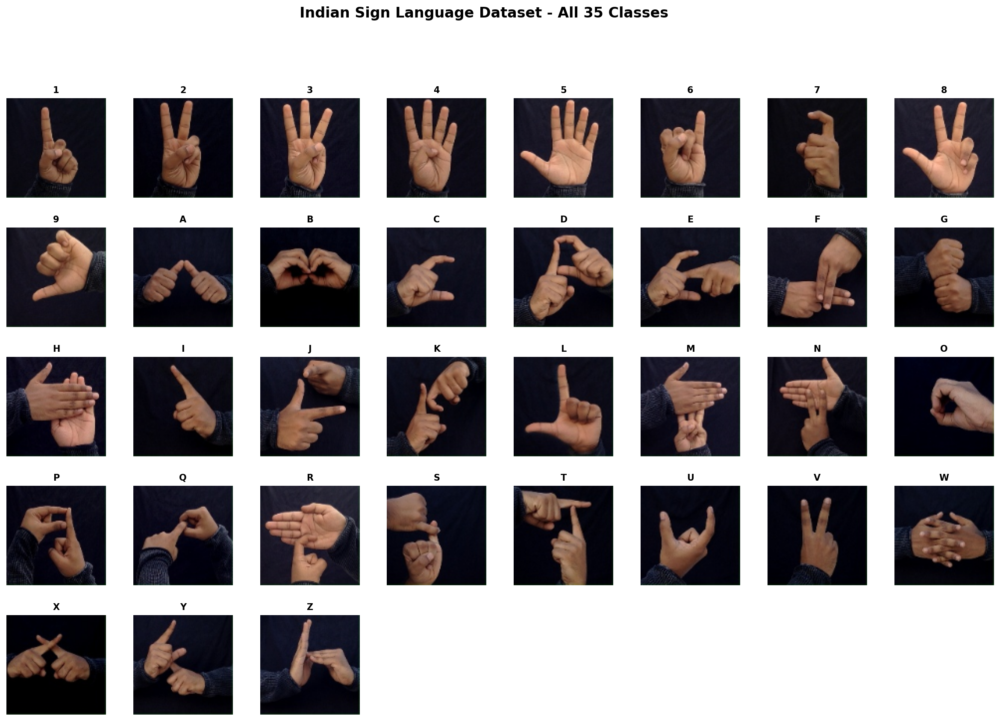

# Sign Language Recognition System

A comprehensive real-time sign language recognition system supporting both **American Sign Language (ASL)** and **Indian Sign Language (ISL)**. The system uses computer vision, machine learning, and web technologies to provide real-time gesture recognition through a web interface.

## 📸 Dataset Overview

The system recognizes **35 Indian Sign Language classes** covering digits (1-9) and letters (A-Z). Below is a visual representation of all classes in the dataset:

<div align="center">



*Figure 1: Complete visualization of all 35 classes in the Indian Sign Language dataset. Each cell shows a sample image from the corresponding class folder.*

</div>

## 📋 Table of Contents

- [Features](#features)
- [Architecture](#architecture)
- [System Requirements](#system-requirements)
- [Installation](#installation)
- [Dataset](#dataset)
- [Model Architecture](#model-architecture)
- [Usage](#usage)
- [Project Structure](#project-structure)
- [API Documentation](#api-documentation)
- [Training](#training)
- [Performance](#performance)
- [Troubleshooting](#troubleshooting)
- [Contributing](#contributing)
- [License](#license)

## ✨ Features

### Dual Model Support
- **ASL Model**: RandomForest classifier using MediaPipe hand landmarks (26 letters A-Z)
- **ISL Model**: Deep CNN using image-based recognition (35 classes: digits 1-9 + letters A-Z)

### Real-Time Recognition
- Live webcam feed processing
- Real-time gesture detection and classification
- WebSocket-based communication for instant updates
- Gesture stability detection to reduce false positives

### User Interface
- Modern web-based interface
- Real-time video streaming (MJPEG)
- Live prediction display
- Model switching capability
- Confidence score visualization

### Technical Features
- GPU acceleration support (CUDA)
- Multi-backend camera support (DirectShow, MSMF, V4L2)
- Robust error handling and camera reconnection
- Cross-platform compatibility (Windows, Linux, macOS)

## 🏗️ Architecture

### System Overview

```
┌─────────────────────────────────────────────────────────────┐
│                    Web Browser (Client)                      │
│  ┌──────────────┐  ┌──────────────┐  ┌──────────────┐     │
│  │   HTML/JS    │  │  WebSocket   │  │   MJPEG      │     │
│  │   Interface  │◄─┤   Socket.IO  │◄─┤   Stream     │     │
│  └──────────────┘  └──────────────┘  └──────────────┘     │
└─────────────────────────────────────────────────────────────┘
                            ▲
                            │ HTTP/WebSocket
                            │
┌─────────────────────────────────────────────────────────────┐
│              Flask Application Server (app.py)               │
│  ┌──────────────────────────────────────────────────────┐   │
│  │              Video Frame Generator                   │   │
│  │  ┌──────────────┐  ┌──────────────┐                │   │
│  │  │   Camera     │  │  MediaPipe   │                │   │
│  │  │   Capture    │─►│  Hand        │                │   │
│  │  │              │  │  Detection   │                │   │
│  │  └──────────────┘  └──────────────┘                │   │
│  │                          │                           │   │
│  │                          ▼                           │   │
│  │  ┌──────────────────────────────────────┐          │   │
│  │  │      Model Selection & Prediction     │          │   │
│  │  │  ┌──────────┐      ┌──────────┐      │          │   │
│  │  │  │   ASL    │      │   ISL    │      │          │   │
│  │  │  │ Random   │      │   CNN    │      │          │   │
│  │  │  │ Forest   │      │  Model   │      │          │   │
│  │  │  └──────────┘      └──────────┘      │          │   │
│  │  └──────────────────────────────────────┘          │   │
│  └──────────────────────────────────────────────────────┘   │
└─────────────────────────────────────────────────────────────┘
```

### Component Breakdown

#### 1. **Frontend (Web Interface)**
- **Technology**: HTML5, JavaScript, Socket.IO Client
- **Features**:
  - Real-time video display
  - Live prediction updates
  - Model switching controls
  - Responsive design

#### 2. **Backend Server (Flask)**
- **Technology**: Flask, Flask-SocketIO
- **Responsibilities**:
  - HTTP server for web interface
  - WebSocket server for real-time communication
  - MJPEG video streaming
  - Request routing and API endpoints

#### 3. **Computer Vision Pipeline**
- **MediaPipe Hands**: Hand landmark detection
- **OpenCV**: Image processing and camera management
- **Frame Processing**: Real-time frame capture and preprocessing

#### 4. **Machine Learning Models**

##### ASL Model (Skeleton-based)
- **Type**: RandomForest Classifier
- **Input**: 42 normalized hand landmark coordinates (21 landmarks × 2D)
- **Output**: 26 classes (A-Z)
- **File**: `model.p` (pickled scikit-learn model)
- **Preprocessing**:
  - Extract MediaPipe hand landmarks
  - Normalize coordinates relative to hand bounding box
  - Create feature vector from normalized landmarks

##### ISL Model (Image-based CNN)
- **Type**: Convolutional Neural Network (CNN)
- **Input**: 256×256 grayscale images
- **Output**: 35 classes (digits 1-9 + letters A-Z)
- **Architecture**:
  ```
  Input (256×256×1)
    ↓
  Conv2D(24) + BatchNorm + MaxPool
    ↓
  Conv2D(64) + Dropout(0.3) + MaxPool
    ↓
  Conv2D(64) + Dropout(0.3) + MaxPool
    ↓
  Conv2D(128) + Conv2D(128) + Dropout(0.3) + MaxPool
    ↓
  Conv2D(256) + Dropout(0.3) + MaxPool
    ↓
  Flatten
    ↓
  Dense(2352) + Dropout(0.5)
    ↓
  Dense(35, softmax) → Output
  ```
- **File**: `checkpoints/best_model_*.h5` or `indian_sign_model.h5`

#### 5. **Prediction Pipeline**

```
Camera Frame
    ↓
MediaPipe Hand Detection
    ↓
┌─────────────────┬─────────────────┐
│   ASL Path       │   ISL Path      │
│                  │                 │
│ Extract          │ Extract Hand    │
│ Landmarks        │ Region (ROI)    │
│    ↓             │    ↓            │
│ Normalize        │ Preprocess      │
│ Coordinates      │ (Grayscale,     │
│    ↓             │  Resize,        │
│ RandomForest     │  Normalize)     │
│ Prediction       │    ↓            │
│                  │ CNN Prediction  │
└─────────────────┴─────────────────┘
    ↓
Gesture Stability Check
    ↓
WebSocket Emission
    ↓
Frontend Display
```

## 💻 System Requirements

### Minimum Requirements
- **OS**: Windows 10/11, Linux (Ubuntu 18.04+), macOS 10.14+
- **Python**: 3.8 or higher
- **RAM**: 4 GB minimum (8 GB recommended)
- **Storage**: 2 GB free space
- **Camera**: USB webcam or built-in camera

### Recommended Requirements
- **CPU**: Multi-core processor (Intel i5/AMD Ryzen 5 or better)
- **GPU**: NVIDIA GPU with CUDA support (optional, for faster inference)
- **RAM**: 8 GB or more
- **Camera**: HD webcam (720p or higher)

### Software Dependencies
- Python 3.8+
- pip (Python package manager)
- Git (for cloning repository)

## 📦 Installation

### Step 1: Clone the Repository

```bash
git clone <repository-url>
cd sign-to-text-and-speech
```

### Step 2: Create Virtual Environment

**Windows:**
```bash
python -m venv venv
venv\Scripts\activate
```

**Linux/macOS:**
```bash
python3 -m venv venv
source venv/bin/activate
```

### Step 3: Install Dependencies

```bash
pip install -r requirements.txt
```

### Step 4: Verify Installation

```bash
python -c "import cv2, mediapipe, flask, tensorflow; print('All dependencies installed successfully!')"
```

## 📊 Dataset

### Indian Sign Language Dataset

The system includes a dataset of **35 classes** covering:
- **Digits**: 1, 2, 3, 4, 5, 6, 7, 8, 9
- **Letters**: A through Z (26 letters)

**Dataset Structure:**
```
Indian/
├── 1/
│   ├── 1.jpg
│   ├── 2.jpg
│   └── ...
├── 2/
│   ├── 1.jpg
│   └── ...
├── A/
│   ├── 1.jpg
│   └── ...
└── ... (35 total classes)
```

**Dataset Statistics:**
- **Total Classes**: 35
- **Total Images**: ~42,510 images
- **Format**: JPG images
- **Organization**: One folder per class

**Visualization:**
The dataset visualization image (shown at the top of this README) displays a grid of sample images from all 35 classes, providing a quick overview of the sign language gestures the system can recognize.

## 🧠 Model Architecture

### ASL Model (RandomForest)

**Input Features:**
- 21 hand landmarks from MediaPipe
- Each landmark has (x, y) coordinates
- Features normalized relative to hand bounding box
- Total: 42 features (21 × 2)

**Model Details:**
- **Algorithm**: RandomForest Classifier
- **Classes**: 26 (A-Z)
- **Training**: Uses MediaPipe landmark data
- **Inference Speed**: ~1-2 ms per prediction

### ISL Model (CNN)

**Architecture Details:**

| Layer | Type | Filters/Units | Output Shape | Parameters |
|-------|------|---------------|--------------|------------|
| Input | - | - | (256, 256, 1) | 0 |
| Conv1 | Conv2D | 24 | (128, 128, 24) | 240 |
| | BatchNorm | - | (128, 128, 24) | 96 |
| | MaxPool | - | (64, 64, 24) | 0 |
| Conv2 | Conv2D | 64 | (32, 32, 64) | 13,888 |
| | Dropout(0.3) | - | (32, 32, 64) | 0 |
| | MaxPool | - | (16, 16, 64) | 0 |
| Conv3 | Conv2D | 64 | (8, 8, 64) | 36,928 |
| | Dropout(0.3) | - | (8, 8, 64) | 0 |
| | MaxPool | - | (4, 4, 64) | 0 |
| Conv4a | Conv2D | 128 | (2, 2, 128) | 73,856 |
| Conv4b | Conv2D | 128 | (2, 2, 128) | 147,584 |
| | Dropout(0.3) | - | (2, 2, 128) | 0 |
| | MaxPool | - | (1, 1, 128) | 0 |
| Conv5 | Conv2D | 256 | (1, 1, 256) | 295,168 |
| | Dropout(0.3) | - | (1, 1, 256) | 0 |
| | MaxPool | - | (1, 1, 256) | 0 |
| Flatten | - | - | (256) | 0 |
| Dense1 | Dense | 2352 | (2352) | 603,264 |
| | Dropout(0.5) | - | (2352) | 0 |
| Output | Dense | 35 | (35) | 82,355 |

**Total Parameters**: ~1,253,583 trainable parameters

**Training Configuration:**
- **Optimizer**: Adam
- **Loss Function**: Categorical Crossentropy
- **Batch Size**: 32-64 (depending on GPU memory)
- **Epochs**: 50 (with early stopping)
- **Data Augmentation**: Rotation, zoom, shear, brightness, shifts, flips
- **Validation Split**: 10% of training data

## 🚀 Usage

### Starting the Application

1. **Activate virtual environment** (if not already active):
   ```bash
   # Windows
   venv\Scripts\activate
   
   # Linux/macOS
   source venv/bin/activate
   ```

2. **Run the Flask application**:
   ```bash
   python app.py
   ```

3. **Open web browser** and navigate to:
   ```
   http://localhost:5000
   ```

### Using the Web Interface

1. **Allow camera access** when prompted by the browser
2. **Position your hand** in front of the camera
3. **Make sign language gestures** - predictions will appear in real-time
4. **Switch models** using the model selector (if both models are available)
5. **View confidence scores** displayed with each prediction

### Model Selection

The system automatically selects the best available model:
- If both models are available: Defaults to ASL model
- If only one model is available: Uses that model
- Models can be switched dynamically via the web interface

### Command Line Options

Currently, the application runs with default settings. Future versions may include:
- Custom port selection
- Camera index selection
- Model path specification
- Debug mode

## 📁 Project Structure

```
sign-to-text-and-speech/
│
├── app.py                          # Main Flask application
├── train_indian_model.py           # ISL CNN training script
├── inference_indian.py             # Standalone inference script
├── generate_dataset_visualization.py # Dataset visualization generator
│
├── requirements.txt                # Python dependencies
├── requirements_training.txt       # Additional training dependencies
│
├── model.p                         # ASL RandomForest model (pickle)
├── indian_sign_model.h5           # ISL CNN model (Keras)
├── indian_sign_weights.h5          # ISL CNN weights
├── class_names.json                # Class name mappings
│
├── checkpoints/                    # Training checkpoints
│   ├── best_model_*.h5            # Best model checkpoints
│   ├── best_weights_*.h5           # Best weights checkpoints
│   ├── logs_*/                    # TensorBoard logs
│   └── training_history_*.png     # Training history plots
│
├── Indian/                         # ISL Dataset
│   ├── 1/                         # Class folders
│   ├── 2/
│   ├── ...
│   ├── A/
│   ├── B/
│   └── ... (35 classes total)
│
├── templates/                     # Web templates
│   └── index.html                 # Main web interface
│
├── dataset_classes_visualization.png  # Dataset visualization
│
└── README.md                       # This file
```

## 🔌 API Documentation

### WebSocket Events

#### Client → Server

**`switch_model`**
- **Purpose**: Switch between ASL and ISL models
- **Payload**:
  ```json
  {
    "model": "ASL" | "ISL"
  }
  ```

#### Server → Client

**`model_info`**
- **Purpose**: Send current model information on connection
- **Payload**:
  ```json
  {
    "current_model": "ASL" | "ISL",
    "asl_available": true | false,
    "isl_available": true | false
  }
  ```

**`model_switched`**
- **Purpose**: Confirm model switch
- **Payload**:
  ```json
  {
    "model": "ASL" | "ISL",
    "status": "success" | "error",
    "message": "Optional error message"
  }
  ```

**`prediction`**
- **Purpose**: Send real-time prediction
- **Payload**:
  ```json
  {
    "text": "A",
    "confidence": 0.95,
    "model": "ASL" | "ISL"
  }
  ```

### HTTP Endpoints

**`GET /`**
- **Purpose**: Serve main web interface
- **Response**: HTML page

**`GET /video_feed`**
- **Purpose**: MJPEG video stream
- **Response**: Multipart MJPEG stream
- **Content-Type**: `multipart/x-mixed-replace; boundary=frame`

**`GET /api/status`**
- **Purpose**: Get model status
- **Response**:
  ```json
  {
    "skeleton_model": true | false,
    "keras_model": true | false
  }
  ```

## 🎓 Training

### Training the ISL Model

1. **Prepare Dataset**:
   - Ensure `Indian/` folder contains organized class folders
   - Each class folder should contain JPG images

2. **Configure Training**:
   - Edit `train_indian_model.py` to adjust:
     - Dataset path
     - Model save paths
     - Batch size, epochs, learning rate
     - Image size and channels

3. **Run Training**:
   ```bash
   python train_indian_model.py
   ```

4. **Monitor Training**:
   - Check console output for progress
   - View TensorBoard logs: `tensorboard --logdir checkpoints/logs_*/`
   - Training history plots saved in `checkpoints/`

5. **Use Trained Model**:
   - Best model saved to `checkpoints/best_model_*.h5`
   - Update `app.py` to use the new model path

### Training Parameters

**Recommended Settings:**
- **Batch Size**: 32-64 (adjust based on GPU memory)
- **Epochs**: 50 (with early stopping)
- **Learning Rate**: 0.001
- **Image Size**: 256×256 (grayscale)
- **Validation Split**: 10-20%

**Data Augmentation:**
- Rotation: ±35 degrees
- Zoom: 0.5x
- Shear: ±0.5
- Brightness: 0.6-1.0
- Shifts: ±10% width/height
- Vertical flip: Enabled

## 📈 Performance

### Model Performance

**ASL Model (RandomForest):**
- **Accuracy**: ~95%+ on test set
- **Inference Time**: 1-2 ms per frame
- **Memory Usage**: ~5 MB

**ISL Model (CNN):**
- **Accuracy**: ~85-90% on test set (varies by class)
- **Inference Time**: 10-50 ms per frame (CPU), 2-5 ms (GPU)
- **Memory Usage**: ~5 MB (model) + ~50 MB (runtime)

### System Performance

- **Frame Rate**: 15-30 FPS (depending on hardware)
- **Latency**: <100 ms end-to-end
- **CPU Usage**: 20-40% (single core)
- **GPU Usage**: 30-60% (if GPU available)

### Optimization Tips

1. **Use GPU**: Significantly faster inference for CNN model
2. **Reduce Image Size**: Lower resolution = faster processing
3. **Skip Frames**: Process every Nth frame for lower CPU usage
4. **Batch Processing**: Process multiple predictions together

## 🔧 Troubleshooting

### Camera Issues

**Problem**: Camera not detected
- **Solution**: Check camera permissions in browser/system settings
- **Alternative**: Try different camera index in code (0, 1, 2)

**Problem**: Camera opens but no frames
- **Solution**: Try different backend (DirectShow, MSMF, V4L2)
- **Check**: Camera is not being used by another application

### Model Loading Issues

**Problem**: Model file not found
- **Solution**: Ensure model files exist in project directory
- **Check**: File paths in `app.py` are correct

**Problem**: TensorFlow/Keras errors
- **Solution**: Reinstall TensorFlow: `pip install --upgrade tensorflow`
- **Check**: Python version compatibility (3.8+)

### Performance Issues

**Problem**: Low frame rate
- **Solution**: Reduce image resolution or skip frames
- **Alternative**: Use GPU acceleration if available

**Problem**: High CPU usage
- **Solution**: Reduce batch size or use GPU
- **Check**: Close other applications using CPU

### Web Interface Issues

**Problem**: Video stream not loading
- **Solution**: Check browser console for errors
- **Check**: Flask server is running and accessible

**Problem**: Predictions not updating
- **Solution**: Check WebSocket connection in browser console
- **Check**: Model is loaded correctly (check server logs)

## 🤝 Contributing

Contributions are welcome! Please follow these steps:

1. Fork the repository
2. Create a feature branch (`git checkout -b feature/AmazingFeature`)
3. Commit your changes (`git commit -m 'Add some AmazingFeature'`)
4. Push to the branch (`git push origin feature/AmazingFeature`)
5. Open a Pull Request

### Areas for Contribution

- Additional sign language support (BSL, etc.)
- Model improvements and optimizations
- UI/UX enhancements
- Documentation improvements
- Bug fixes and performance optimizations

## 📄 License

This project is licensed under the MIT License - see the LICENSE file for details.

## 🙏 Acknowledgments

- **MediaPipe**: For hand landmark detection
- **TensorFlow/Keras**: For deep learning framework
- **Flask**: For web framework
- **OpenCV**: For computer vision operations
- **scikit-learn**: For machine learning utilities

## 📧 Contact

For questions, issues, or contributions, please open an issue on GitHub.

---

**Last Updated**: December 2025
**Version**: 1.0.0
